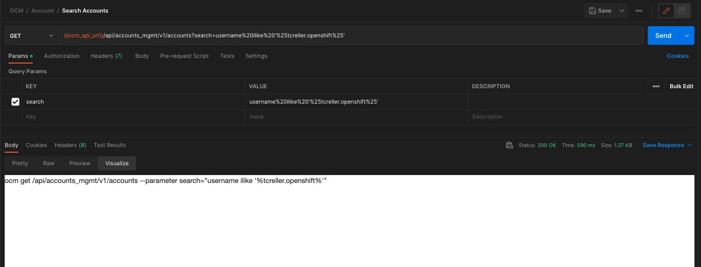

# OCM CLI Shim
This shim provides an API layer on top of your local ocm-cli instance that allows an application (i.e. postman) to retrieve information from your current session; such as your authentication token and current environment URL.

## Pre-requisites
[ocm-cli](https://github.com/openshift-online/ocm-cli) setup and logged into an environment

## Running the application

```
go run .
```

## Usage
### Postman

A collection and environment are available for import from the `/postman` folder. These should work out of the box and allow you to start building requests with no additional configuration. The collection is setup to fire a pre-request script to the shim to populate the `ocm_token` and `ocm_api_url` environment variables. The collection has authorization set-up and will apply it to every request that inherits the auth from it's parent.

#### Manual setup
Create a [new environment](https://learning.postman.com/docs/sending-requests/managing-environments/#creating-environments) to store your OCM CLI variables in. For example, an environment named `OCM CLI`.

Setup the following [pre-request script](https://learning.postman.com/docs/writing-scripts/pre-request-scripts/#scripting-before-your-request-runs). This can be done at the collection, folder, or request level. This script will add/populate the `ocm_token` and `ocm_api_url` environment variables from the shim API response.

```javascript
pm.sendRequest('localhost:8082', (err, response) => {
    const responseJson = response.json();
    pm.environment.set("ocm_token", responseJson.token);
    pm.environment.set("ocm_api_url", responseJson.url);
})
```

Lastly, configure your requests to use the environment variables. `ocm_token` will be used for your `Bearer Token` authorization and `ocm_api_url` will be used in your request URLs.

#### Additional Features
##### Automatic ocm-cli request conversion
When using the embedded postman collection an ocm-style request will be generated in the visualize tab. This makes things easier to share with others who may only use the ocm-cli.

